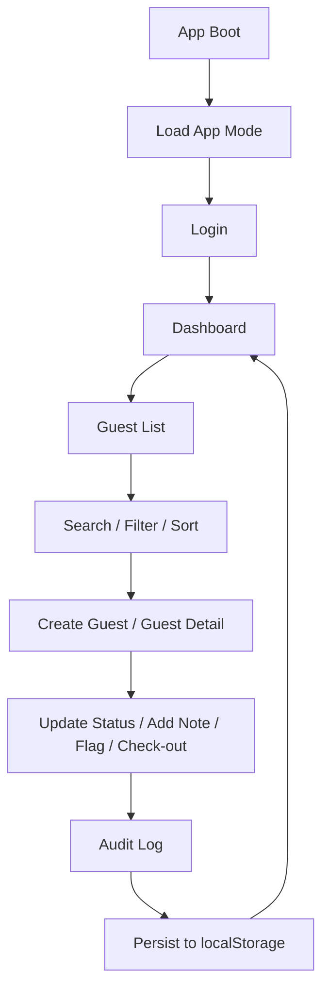
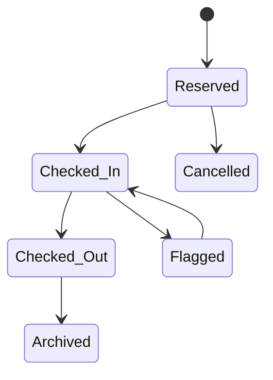

# Mini Guest Reception App Demo Notes

## Purpose

This is an intentionally vulnerable frontend-only hotel reception demo. It models a lightweight receptionist/admin workflow with guest lifecycle management, audit logs, seeded demo data, and a controlled Security Training Mode.

This app is not production-secure.

## Demo Users

- Receptionist: `receptionist01` / `password123`
- Admin: `admin01` / `admin123`

## Modes

- Normal Demo Mode: professional operational UI with safer note rendering.
- Security Training Mode: intentionally renders guest notes unsafely to demonstrate stored XSS.

The selected mode is stored in `localStorage` under `vivere_app_mode_v1`.

## Reset Demo Data

1. Login as `admin01`.
2. Click `Reset Demo Data`.
3. Guest records and audit logs return to the seeded presentation dataset.

## Intentional Vulnerabilities

- localStorage session tampering: session and role are stored in `vivere_session_v1`, allowing role escalation demos by changing `role` from `receptionist` to `admin`.
- Stored XSS demo: in Security Training Mode, guest notes are rendered with unsafe HTML. Sample payload is documented in source comments only.
- UI-only authorization weakness: admin buttons are hidden for receptionists, but authorization trusts localStorage session data by design.
- Sensitive data exposure: guest data, audit logs, app mode, and session are all localStorage-backed.
- Weak mock credentials: demo usernames and passwords are hardcoded and compared in frontend code.
- IDOR-style guest lookup: guest detail uses direct client-side guest ID lookup.
- Editable audit log: audit records are stored in localStorage and can be modified through devtools.

Every controlled vulnerability added for the demo is marked in source with:

```text
INTENTIONAL VULNERABILITY FOR DEMO PURPOSES
```

## Suggested Demo Script

1. Open the app and login as `receptionist01`.
2. Show dashboard metrics, guest list search/filter/sort, and guest detail drawer.
3. Create a new reserved guest and add an operational note.
4. Check the guest in, then check the guest out.
5. Attempt an admin-only archive/delete action as receptionist and show the unauthorized message.
6. Login as `admin01`, open audit logs, and show role-specific controls.
7. Toggle Security Training Mode.
8. Add a stored XSS note payload from devtools or the note editor, then reopen the detail drawer to demonstrate unsafe note rendering.
9. Show localStorage keys for session, guest data, audit logs, and app mode.
10. Change the session role in localStorage to demonstrate client-side role tampering.
11. Use Reset Demo Data to return the app to the known seed state.

## Flow Target




